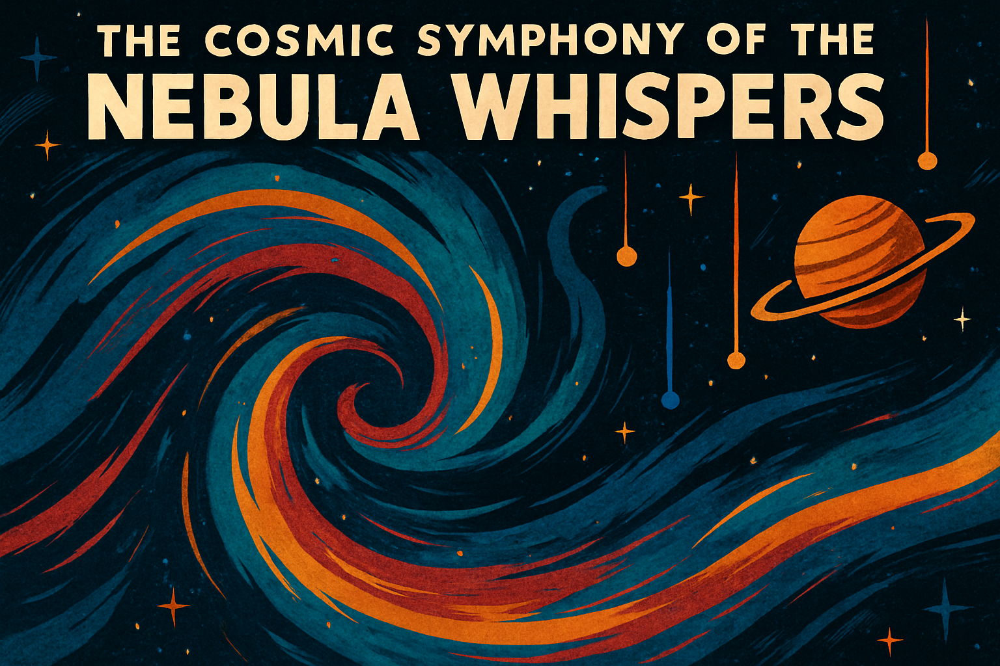
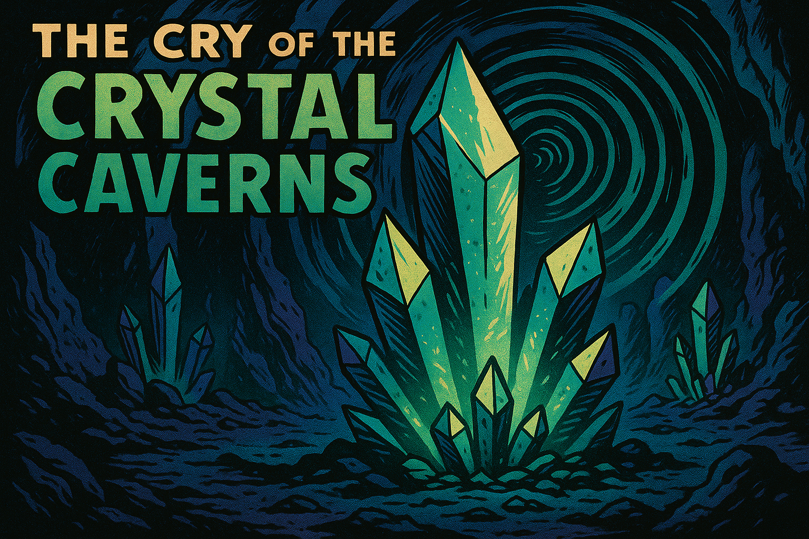

# 📚 The Curiosities of the Opera of Weirdness

Welcome, honored traveler, catalog enthusiast, or lost interdimensional intern.

Here in the Grand Curiosity Index, you will find a non-exhaustive (and occasionally incomprehensible) listing of the unique sonic marvels carefully, dangerously, and sometimes accidentally gathered by the Opera's Research Division.

Each of these phenomena represents not just an audio recording, but an **entire fragment of the universe’s collective madness**, bottled neatly for your educational confusion.

Proceed with an open mind, well-secured ear protection, and a tolerance for minor chronological displacements.

---

## 🎶 The Grand List of Curiosities

---

  <!-- Placeholder for your Flock Logo/Banner - Replace URL -->
  

### The Cosmic Symphony of the Nebula Whispers (Nebulara)

Imagine standing inside a giant, irritable jellyfish made entirely of starlight while it hums to itself.  
Nebulara captures the vibrations and electromagnetic tantrums of a distant nebula and converts them into haunting melodies that are best described as “melancholy, majestic, and slightly sticky.”

---

  <!-- Placeholder for your Flock Logo/Banner - Replace URL -->
  

### The Cry of the Crystal Caverns (The Crystacore Caverns)

Some planets have underground aquifers. Some have natural gas.  
**Crystacore Caverns** have kilometer-high crystal cathedrals that scream musically when the temperature changes.  
The Opera’s researchers advise visiting during the "gentle hum" season rather than the "cataclysmic shriek" season.

---

### The Melancholy Melody of the Moonlit Marsh (The Marsh of Melankara)

Wind, water, and the deeply suspicious amphibians of Melankara collaborate nightly to create melancholic melodies.  
It’s part folk song, part existential sigh, and entirely the fault of the marsh's unusual atmospheric resonance.

---

### The Time-Warped Tunes of the Temporal Travelers (Chronomancers of Tempora)

Ever heard music that plays backwards, forwards, and sideways all at once?  
The Chronomancers of Tempora would apologize for the inconvenience, but they haven't gotten around to inventing that part of the timeline yet.

---

### The Bioluminescent Ballad of the Deep Sea Dreamers (Abyssalor)

Deep beneath the phosphorescent oceans of Abyssalor, creatures communicate using pulses of light and vibration.  
The result is a symphony so profound that it has caused passing submarines to experience existential crises and at least one jellyfish to become a published poet.

---

### The Technorganic Tunes of the Cyber Forest (The Mechanaflora Forest)

Half machine, half moss — fully committed to making noise.  
The Cyber Forest of Mechanaflora is alive, unregulated, and still arguing internally whether it’s producing music or just very stylish errors.

---

### The Harmonious Hum of the Hovering Hives (The Aeriloon Swarms)

Tiny airborne beings whose synchronized wingbeats create symphonies of unsettling precision.  
The Aeriloon Swarms have an annual festival where they attempt to out-hum one another.  
It’s best not to attend without reinforced ear protection and emotional stability.

---

### The Echoes of the Enchanted Echo Chamber (The Resono Cavern of Eldoria)

Speak a word inside the Resono Cavern and it will respond, not with what you said, but with what it *thinks you meant.*  
This has led to diplomatic incidents, accidental marriage proposals, and at least one spontaneous intergalactic poetry slam.

---

### The Drone of the Dimension Drifters (Drifters of the Multivox)

Drifting between realities makes a noise — usually a dull hum, sometimes a soul-rending bass drop.  
The Drifters of the Multivox exist in a state of constant sonic transition, and their music is beloved by entities who can listen sideways in time.

---

### The Lullaby of the Living Labyrinth (The Labyre Enigma)

This labyrinth changes itself based on sound — or possibly changes sound based on itself — the researchers haven't agreed yet.  
What is certain is that if you hum the right tune, the maze will politely guide you out.  
Hum the wrong tune, and you may find yourself back at your kitchen, but two weeks earlier.

---

### The Rhythmic Rumble of the Resonant Rocks (The Vibrarock Plains of Geon)

Large boulders that vibrate and rumble like polite, prehistoric bass drums.  
The native inhabitants use the Vibrarocks for concerts, religious ceremonies, and occasionally, aggressive synchronized napping.

---

### The Song of the Solar Flares (The Solara Serenade)

Solar flares were already known to cause communications blackouts, but no one suspected they were also composing symphonies in the gamma spectrum.  
The Solara Serenade brings this furious, fiery music into the realm of human hearing.  
Approach with sunblock. Heavy sunblock. And maybe a lead umbrella.

---

### The Whistle of the Windwalkers (The Windspirits of Aeloria)

The Windspirits of Aeloria treat the upper atmosphere like a giant pan flute.  
Each one whistles a slightly different tune, creating ethereal choirs that drift across the landscape and confuse meteorologists terribly.

---

### The Groove of the Gravity Wells (The Gravirhythm Wells of Singulon)

Gravity does strange things to space and time. It also does strange things to rhythm.  
The Gravirhythm Wells produce musical grooves by stretching, twisting, and compacting beats until the concept of a "drop" becomes uncomfortably literal.

---

### The Chant of the Celestial Choir (The Aetherium Chorale)

High above the gas giants, beings of shimmering plasma sing harmonic chants that ripple through the dense atmosphere.  
It is said their music is what first taught the universe how to be beautiful — and how to be occasionally and gloriously out of tune.

---

# 🎭 Curiosity Collection Note

All Curiosities are collected under Section 7-B of the Grand Codex of Inexplicable Acoustic Anomalies.  
Handling with caution is advised. Handling with jazz hands is encouraged.

