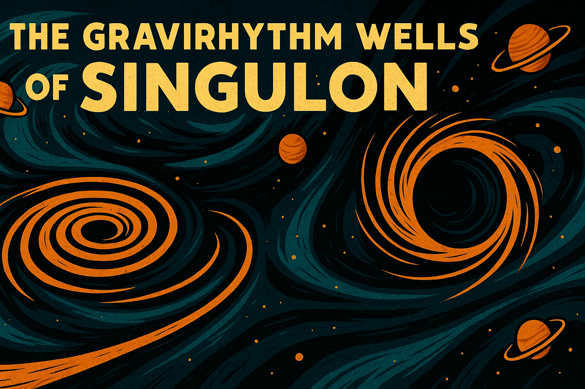

# 📚 The Curiosities of the Opera of Weirdness

Welcome, honored traveler, catalog enthusiast, or lost interdimensional intern.

Here in the Grand Curiosity Index, you will find a non-exhaustive (and occasionally incomprehensible) listing of the unique sonic marvels carefully, dangerously, and sometimes accidentally gathered by the Opera's Research Division.

Each of these phenomena represents not just an audio recording, but an **entire fragment of the universe’s collective madness**, bottled neatly for your educational confusion.

Proceed with an open mind, well-secured ear protection, and a tolerance for minor chronological displacements.

---

## 🎶 The Grand List of Curiosities

<table>
<tr>
  <td align="center">
  🌌 
    <a href="nebula_whispers">
       
      
      <strong>The Cosmic Symphony of the Nebula Whispers</strong>
    </a>
  </td>
  <td align="center">
  💎 
    <a href="crystal_caverns">
       
      
      <strong>The Cry of the Crystal Caverns</strong>
    </a>
  </td>
  <td align="center">
  🌀 
    <a href="gravirhythm_wells">
       
      
      <strong>The Gravirhythm Wells of Singulon</strong>
    </a>
  </td>
</tr>
</table>

---

# 🎭 Curiosity Collection Note

All Curiosities are collected under Section 7-B of the Grand Codex of Inexplicable Acoustic Anomalies.  
Handling with caution is advised. Handling with jazz hands is encouraged.

